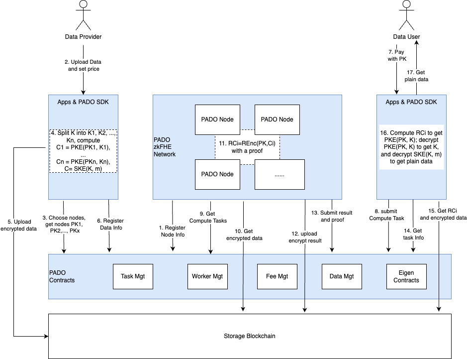

# pado-network

## Introduction

PADO leverages the contract to offer zkFHE-based decentralized computing units, providing trustless and confidential computing capabilities. It also utilizes Storage Blockchain as a private data storage layer.

Users who want to get the data from Storage Blockchain can easily utilize PADO's zkFHE technology to make confidential computation requests to the contract. These requests are sent to PADO's zkFHE compute nodes.

PADO's zkFHE techniques are designed on top of the FHE algorithm, which synchronously performs ZK proof on the homomorphic computation process. The simultaneous integrity constraints ensure the reliability of homomorphic operations and the correctness of the encrypted result while preserving data privacy during the whole process. 

zkFHE is a novel cryptographic technology that organically combines the two cutting-edge cryptographic primitives, ZK and FHE, and uses the advantages of the two to complement each other, thus providing practical **verifiable confidential computation**(VCC). PADO's zkFHE technique offers several core advantages, including **openness**, **privacy-friendly**, and **computational integrity**. We believe that zkFHE is the fundamental technology for building a verifiable data economy in the Web3 era.

PADO's zkFHE network integrates seamlessly with the contracts and Storage Blockchain. As long as the computing, scheduling, and storage functionalities operate independently, this allows for the indefinite expansion of computing power. This enables to leverage PADO's zkFHE technology to access verifiable confidential computation and comprehensive privacy protection capabilities.

## About the Implementation

Currently, we use a linearly homomorphic encryption (LHE) scheme for data-sharing purposes. The initial version of the prototype provides a plain threshold FHE version to achieve the whole functionalities without zk-based integrity ensurance. However, we believe this basic algorithm meets most of the requirements for simple applications. We will gradually build this repo with zk-LHE, adding a zero-knowledge capability to prove each procedure of the underlying linearly homomorphic encryption scheme.

Currently, it supports both Ethereum and AO networks, and will expand to more blockchain networks in the future. Now, using the EigenLayer framework on the Ethereum network, EigenLayer operators can register to PADO AVS to become PADO Network Workers, and can also register as AO PADO Network Workers at the same time, so that they can get more computing fees.

We are currently using Arweave as the storage blockchain, and will expand to more storage blockchains in the future, such as Filecoin, Greenfield, etc.

## Main Components

The data sharing and incentive workflow allows data providers to share their data securely and privately with data users. Key components are listed as follows:

1. **PADO SDK**
   
    Through the SDK developers can upload a user's encrypted data, and decrypt the ciphertext data.
   
   The github link: [PADO SDK](https://github.com/pado-labs/pado-ao-sdk).

2. **PADO Contract**
   
   PADO Contract, which mainly manages data, nodes, verifiable confidential computing tasks and related results. The contract also handles computation costs.

   The github link of Ethereum: [PADO Network Contracts](https://github.com/pado-labs/pado-network-contracts).
   
   The github link of AO: [PADO AO Process](https://github.com/pado-labs/pado-ao-process).

3. **PADO Node**
   
   PADO Node is an environment that truly performs verifiable confidential computations. Mainly to obtain verifiable confidential computing tasks, execute tasks, and report results.

   The github link: [PADO Node](https://github.com/pado-labs/pado-network/tree/main/padonode). The [WASM wrapper](https://github.com/pado-labs/pado-network/blob/main/lib/lhe/README.md) for [threshold-zk-LHE](https://github.com/pado-labs/threshold-zk-LHE).

## Workflow

1. **Register PADO Node**
   
   After the PADO Node is started, it shall be registered in the Worker Management Contract. The registered information includes name, description, public key, owner address, etc.
   
2. **Upload data**
   
   Data Providers can upload encrypted data through dapp based on the PADO SDK and set data prices at the time of upload.
   The data encrypted by the FHE algorithm and the PADO Node public key will be uploaded to Arweave, and the data information will be registered to the Data Management Contract.

3. **Submit task**
   
   Data users can submit computation tasks with their public keys through dapp based on PADO SDK, and pay certain computation fees and data usage fees. The computation tasks will be submitted to the Task Management Contract.

4. **Task execution**
   
   PADO Node obtains computing tasks from the Task Management Contract, uses the LHE algorithm to compute the tasks, and reports the results to the Task Management Contract after computation. Task Management Contract verifies the results. After completing the verification, the fee is distributed to the data provider and PADO Nodes.

5. **Get Result**

   Data users obtain encrypted data from Arweave, obtain task results and related information from the contracts and storage blockchain, and then use the LHE algorithm with their private key in the SDK to decrypt the results.
