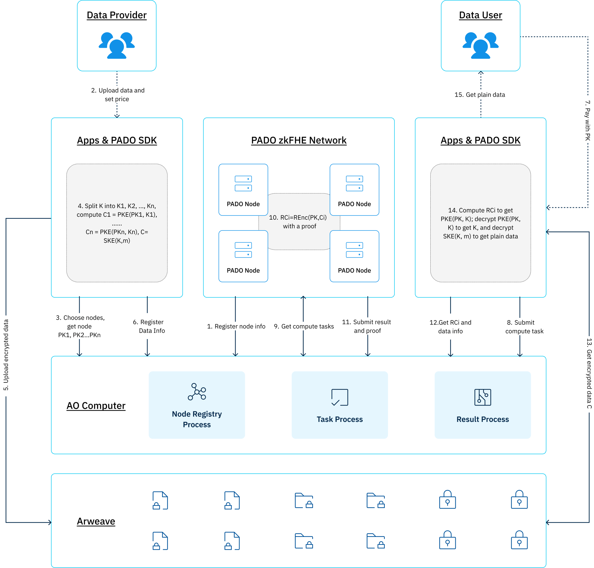

# pado-network

## Introduction

PADO Network is a zkFHE Decentralized Computation Network. PADO will gradually build a decentralized computer unit based on AO, providing trustless and confidential computing capabilities for the AO ecosystem.

More importantly, PADO will use the Arweave blockchain as a privacy data storage layer. Users can encrypt their own data and store it securely on the Arweave blockchain through PADO's zkFHE technology. Any confidential computation request within the AO ecosystem can be sent to the zkFHE computing nodes of PADO Network through the AO.

## Why PADO and AO

zkFHE is designed on top of the FHE algorithm, which synchronously performs ZK proof on the homomorphic computation process. The simultaneous integrity constraints ensure the reliability of homomorphic operations and the correctness of the encrypted result while preserving data privacy during the whole process. zkFHE is a novel cryptographic technology that organically combines the two cutting-edge cryptographic primitives, ZK and FHE, and uses the advantages of the two to complement each other, thus providing practical **verifiable confidential computation (VCC)**.

In summary, the core advantage of zkFHE include:

● Privacy-friendly

● Computational Integrity

● General-purpose computation

Therefore, we believe that zkFHE is the fundamental technology for building a verifiable data economy in the Web3 era.

zkFHE can support any type of ciphertext computing, which breaks the ceiling of privacy restrictions for the current blockchain applications and can realize broader and richer scenarios. Typical applications include payment, voting, auction, MEV, content sharing, privacy-preserving AI, and many other fields.

zkFHE stands as a groundbreaking cryptographic technology, which goes beyond a mere amalgamation of zkSNARKs and FHE algorithms. Instead, it demands a meticulous redesign and optimization of the underlying cryptographic protocols to attain the same efficiency as performant FHE algorithms.

When integrated with AO and Arweave networks, PADO swiftly launches the zkFHE network in practice. Its computing, scheduling, and storage functionalities operate independently, allowing for an indefinite expansion of computing power. Furthermore, the AO ecosystem can leverage PADO's zkFHE technology to access verifiable confidential computation and comprehensive privacy protection capabilities.

PADO has long been dedicated to constructing a cryptographic infrastructure for personal data sovereignty. While personal data sovereignty remains in its nascent stages, it will undergo extensive exploration and validation, serving as a pivotal element for the Web3 project's expansion beyond the non-financial domain. We firmly believe that the integrationwith the AO hyper-parallel computer, will significantly expedite the establishment of personal data sovereignty and a verifiable data economy.

Looking ahead, we envision a future where every user can safeguard their data sovereignty through blockchain and cryptography.

## Roles

There are three roles in PADO Network, namely `PADO Node`, `Data Provider` and `Data User`.

### PADO Node

`PADO Node` provides computation services. It publishes its public key for `Data Provider` to encrypt data and reencrypts the encrypted data by `Data Provider` using the public key of `Data User`.

### Data Provider

`Data Provider` is the owner of `Data`. It encrypts data using the public keys of `Data Provder` and publishes it on Arweave.

### Data User

`Data User` is the consumer of `Data`. It submits a task containing its public key to `PADO Node` and decrypts the reencrypted data to get the plain data provided by `Data Provider`.

## Components

PADO Network consists of three parts: PADO AO SDK, PADO AO Process and PADO Node.

### PADO AO SDK

This is AO SDK of PADO Network for dapps developer. Through the SDK developers can upload user encrypted data, obtain and decrypt data.

For specific interface details, please refer to the github link: https://github.com/pado-labs/pado-ao-sdk.

### PADO AO Process

PADO AO Process is processes on AO, which mainly manages data, manages nodes, manages verifiable confidential computing tasks and results, and handles computing costs.

The github link: https://github.com/pado-labs/pado-ao-process.

### PADO Node

PADO Node is an environment that truly performs verifiable confidential computations. Mainly to obtain verifiable confidential computing tasks, execute tasks, and report results.

The github link: https://github.com/pado-labs/pado-network/tree/main/padonode.

The [WASM wrapper](./lib/lhe/README.md) for [threshold-zk-LHE](https://github.com/pado-labs/threshold-zk-LHE).

## Architecture

### Register PADO Node

After PADO Node is started, it needs to be registered in the Node Registry Process in AO. The registered information includes name, description, publickey and owner address, etc.

### Upload Data

Data Provider can upload encrypted data through dapp developed based on PADO SDK and set data prices at the same time. The data encrypted by the FHE algorithm and the PADO Node public key will be uploaded to Arweave, and the data information will be registered to AO's Data Registry Process.

### Submit Task

Data User submits computation tasks with Data User Public Key through the dapp developed based on PADO SDK, and pays a certain computation and data fee. The computation tasks will be submitted to AO's Task Process.

### Get and Run Task

PADO Node obtains computing tasks from the Task Process in AO, uses the zkFHE algorithm to run the tasks, and reports the results to the Task Process after running.

Task Process verifies the results, and after passing the verification, the fee is distributed to the Data Provider and PADO Node.

### Get Data

Data User obtains encrypted data from Arweave, obtains task results and data information from Process, and then uses the FHE algorithm and Data User Public Key in the SDK to decrypt the results.
