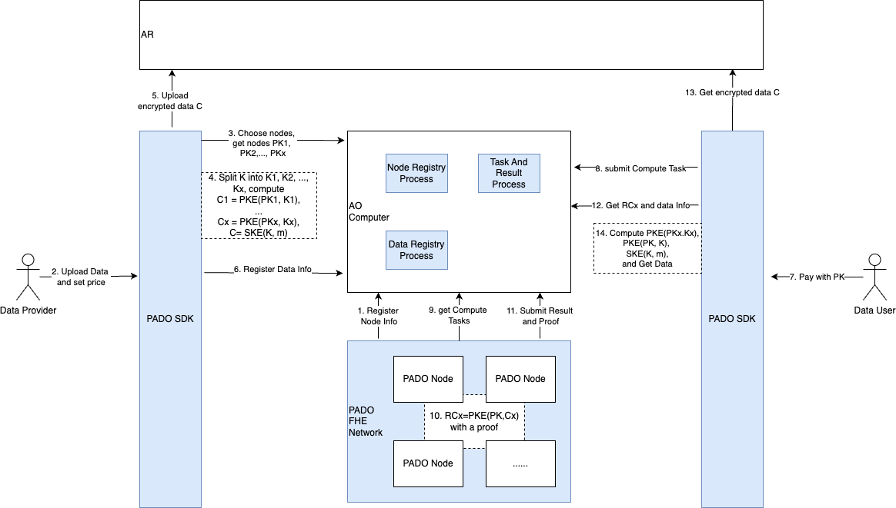

# pado-network

## Introduction

PADO Network is a Decentralized Verifiable Confidential Computation Network. PADO will gradually build a decentralized computer unit based on AO, providing trustless and confidential computing capabilities for the AO ecosystem. More importantly,

PADO will use the Arweave blockchain as a privacy data storage layer. Users can encrypt their own data and store it securely on the Arweave blockchain through PADO's zkFHE technology. Any confidential computation request within the AO ecosystem can be sent to the zkFHE computing nodes of PADO Network through the AO.

## Components

PADO Network consists of three parts: PADO AO SDK, PADO AO Process and PADO Node.

### PADO AO SDK

This is AO SDK of PADO Network for dapps developer. Through the SDK developers can upload user encrypted data, obtain and decrypt data.

For specific interface details, please refer to the github link: https://github.com/pado-labs/pado-ao-sdk.

### PADO AO Process

PADO AO Process is processes on AO, which mainly manages data, manages nodes, manages verifiable confidential computing tasks and results, and handles computing costs.

The github link: https://github.com/pado-labs/pado-ao-process.

### PADO Node

PADO Node is an environment that truly performs verifiable confidential computations. Mainly to obtain verifiable confidential computing tasks, execute tasks, and report results.

The github link: https://github.com/pado-labs/pado-network/tree/main/padonode.

The [WASM wrapper](./lib/lhe/README.md) for [threshold-zk-LHE](https://github.com/pado-labs/threshold-zk-LHE).

## Architecture

## Main types and interface specifications
